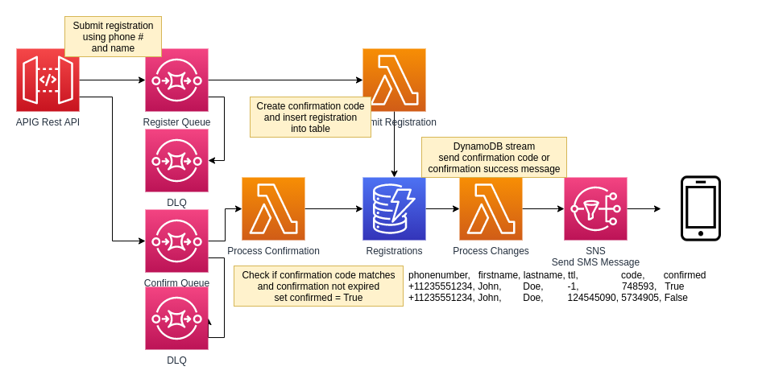

# Serverless De-coupled SMS Registration System

- Registration and Confirmation requests are de-coupled from backend using SQS Queues for durable storage.
- SNS used for delivery of confirmation codes via SMS.
- DynamoDB Table used for native TTL expiration on un-confirmed registrations.

1. `POST /register` request with phone number, first name, and last name.
2. Receive a confirmation code via SMS at the provided phone number.
3. `GET /confirm?phonenumber=...&code=...` request with the phone number and confirmation code to confirm the registration.
4. Registration and confirmation code will eventually expire and a new registration must be submitted.